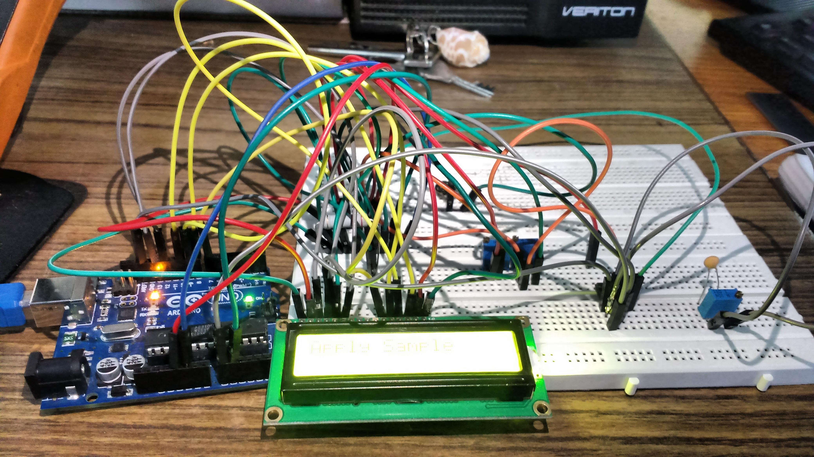
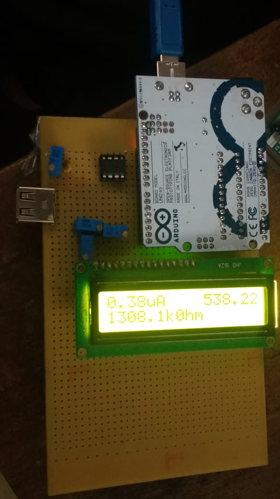
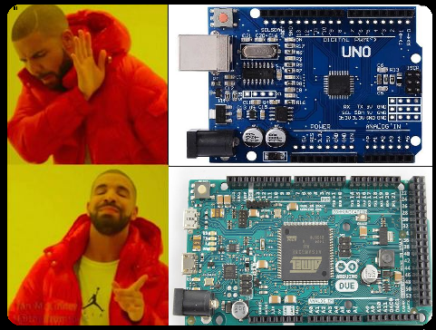

# Read-Out-Circuit-for-Biosensors
The readout circuit is designed to (read) the value of the sample electrode, and display its value on LCD.
The read out circuit that has been used in our project is based on a CTNI test. The readout circuit has been designed to accurately predict the amount of troponin in the blood, by the means of conductivity of analyte.

## So That's how it all started!!!
 <ul>
  <li>CTNI TEST</li>
  <li>HOW IS IT CONDUCTED?</li>
  <li>HOW WE DESIGNED A CIRCUIT FOR THE SAME PURPOSE.</li>
  <li>Basically, It’s called – THE READOUT MACHINE……OR whatever fancy name you like!</li>
</ul> 

## Different Sections of the Project
 <ul>
  <li>THE SOFTWARE SECTION: Carrying out simulations on the circuit</li>
  <li>THE HARDWARE SECTION: Designing and working on the hardware section, taking readings, improving resolution</li>
  <li>THE DISPLAY SECTION: Development of an app which was bluetooth controlled</li>
</ul> 

## The HARDWARE SECTION
Here’s what the circuit looks like:

Well….In reality it looks like this……

## Hardware components: (the stuff we used in our circuit)
 <ul>
  <li>ATMEGA 328</li>
  <li>Operational amplifiers: LM358/LM324/TSU112/TSU111</li>
  <li>ADC: initially Arduino Uno, due then ADS1115</li>
  <li>Resistors</li>
  <li>Capacitors</li>
  <li>LCD display</li>
</ul> 

## USING LM358 and Arduino UNO

  

    
  

  

    
  

</body>

MOVING TOWARDS BETTER RESOLUTION: LM324
<ul>
  <li>WHY LM324 is better than LM358? 
  Lm324 has the biasing current of 45nA whereas the LM358 has the biasing current of 100nA.</li>
  <li>WHAT is up with THE BIASING CURENTS ?? 
One of the golden rules of op amp analysis says this: no current flows into either input terminal. This concept is key for analyzing an amplifier's signal gain. However, in reality, a small current flows into both inputs to bias the input transistors. Unfortunately, this bias current gets converted into a voltage by the circuit's local resistors and amplified right along with the signal. The result is an output error in your circuit. What can you do about it? A clever choice of resistor values can help you cancel most of the output error. The remaining error can be adjusted to zero if necessary.</li>
 </ul>
 
 ## RESOLUTION : WHY DO WE EVEN CARE??
 <ul>
 <li>Embedded into the Arduino microprocessor is an Analog to Digital Converter (ADC).   This ADC takes an analog signal, measures it, and converts it to digital (or binary).  The number of bits used to the digitally communicate the binary value represents the resolution.</li>
 <li>In fact,  ADCs are often described by their resolution.   When we hear that a device has a 10 bit Analog to Digital Converter,  we know that it uses ten digital bits to describe an analog value.  Similarly, a 24 bit Analog to Digital converter will use 24 pieces of information to tell us what the analog value is.</li>
 <li>Generally speaking, when a device has higher resolution, it provides more detail, information, or definition than the device that has lower resolution.</li>
 </ul>
 ## USING LM324 and ArduinoUNO!

## STRECHING OUR BOUNDARIES: USING ADS115 AND TSU111
<ul>
 <li>Why ADS1115? ADS1115 is a 16 bit analog to digital convertor. Earlier we were using 10 bit ADC in Arduino Uno or 12 bit ADC in Arduino Due. In order to display the exact same value of the voltage and resistances, we need to increase the resolution of our ADC’s. Due to unavailability of higher bit ADC’s in Arduino modules, we went for an external ADC which could further be interfaced with Arduino. 
The ADS1115 is an external digital analog converter (ADC) that we can connect to a processor like Arduino to measure analog signals. Arduino has internal ADCs that we use when we use the Arduino analog inputs. On the Arduino Uno, Mini and Nano models, we have 6 ADC of 10 bits. The ADS1115 provides 4 16-bit ADCs, 15 for the measurement and one last for the sign. The ADS1115 is connected by I2C, so it is easy to read. It has 4 addresses, which is chosen by connecting the ADDRESS pin. The interest of using an ADC such as the ADS1115 is to obtain greater precision, in addition to freeing the processor from this burden. In addition, in certain configurations, it is possible to measure negative voltages.</li>
 <li>Why TSU111? 
TSU111, TSU112 and the TSU114 are operational amplifiers (op-amp) which offer an ultra low-power consumption per channel of 900 nA typical and 1.2 μA maximum when supplied by 3.3 V. Combined with a supply voltage range of 1.5 V to 5.5 V. these features allow the TSU11x to be efficiently supplied by a coin type Lithium battery or a regulated voltage in low-power applications. 
## Results
  

  

  

 

